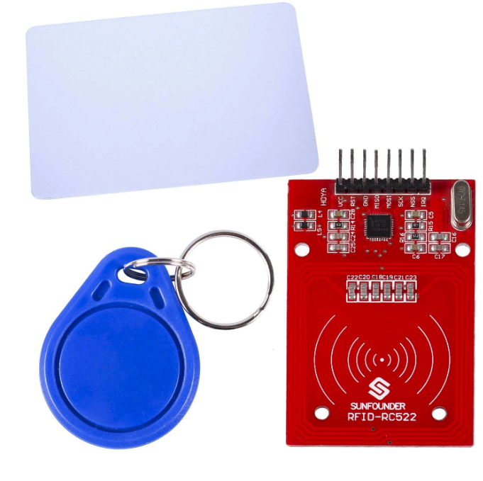
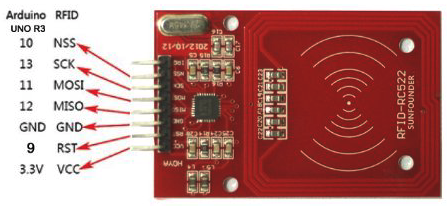
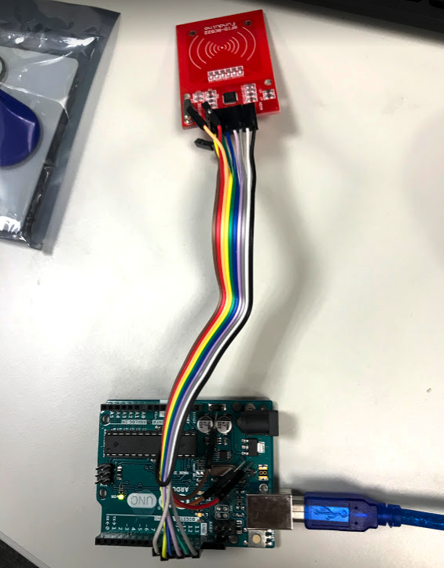
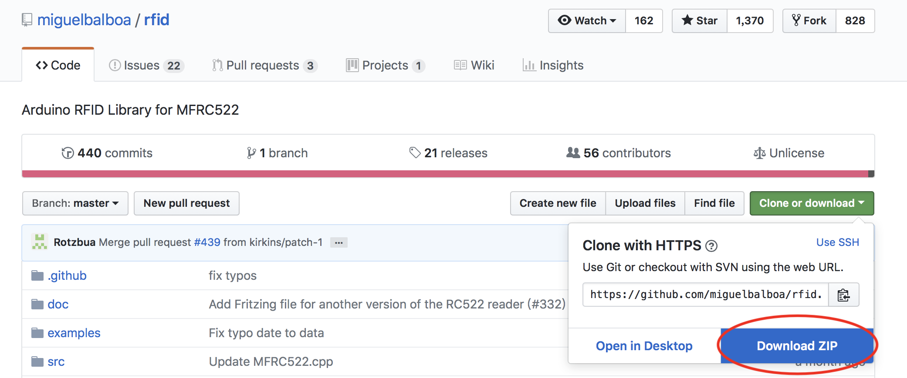
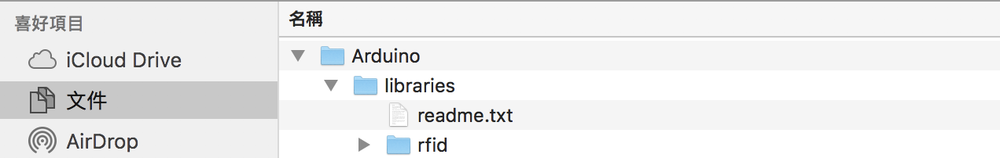
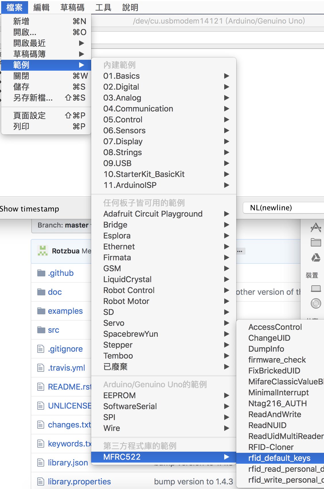
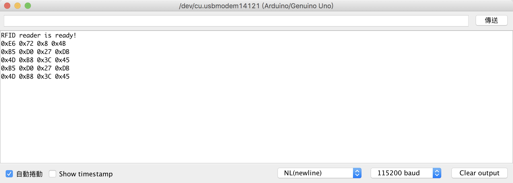

我買的Arduino Starter Kid中，有一組Mifare RFID-RC522模組

一張感應卡和一個鈕扣型感應卡以及讀卡模組 




RFID-RC522與Arduino UNO的接線可以參考下圖




> 注意，RFID-RC522上的IRQ目前是沒有使用到的


透過上述線路圖實際接線



下載[MFRC522程式庫](https://github.com/miguelbalboa/rfid)



把rfid-master整包copy到文件->Arduino->libraries




重新啟動Arduino IDE

就會出現關於RFID-RC522的範例程式來使用




底下這個範例程式是

檢查有沒有卡片，有的話就把卡片的UID給讀取出來

```
# include <SPI.h>

# include <MFRC522.h>

# define RESET 9 //重置腳位

# define SS 10 //晶片選擇腳位

MFRC522 mfrc522(SS, RESET);
void setup() {
  // put your setup code here, to run once:
  Serial.begin(115200);
  SPI.begin();
  Serial.println("RFID reader is ready!");

  mfrc522.PCD_Init(); //初始化
}

void loop() {
  // put your main code here, to run repeatedly:
    if (mfrc522.PICC_IsNewCardPresent()) {  //是否有新卡片
    if (mfrc522.PICC_ReadCardSerial()){
      byte *id = mfrc522.uid.uidByte;   //讀取卡片ID
      byte idSize = mfrc522.uid.size;   //卡片ID的長度
      for (byte i = 0; i < idSize; i++) {
        Serial.print("0x");
        Serial.print(id[i], HEX);      //顯示id
        Serial.print(" ");
      }
      Serial.println();
    }
    mfrc522.PICC_HaltA();  //暫停，避免重複讀取
  }
}
```


實際運行的結果，確實可以Work!!



