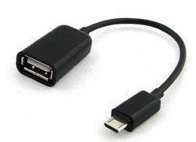

# 前言

一直有在研究要如何去儲存自己的照片影片和個人資料，有看過許多的工具Google Drive, iCloud等，優點就是前述整合手機、電腦備份，方便使用，但缺點就是免費的容量不夠用，要多就要繳月租費了。

再來就是AWS了，就是和Amazon租一個虛擬主機或是服務，但AWS是用量來計費，只要花錢都不太OK。我也曾在自己個人PC上架設私有雲的伺服器，也運作一段時間，唯一的缺點就是感覺耗電，再來就是小小人很聰明，知道怎麼去關電腦。

後來有聽同事說他們都是用NAS來管理自己的照片影片，也可以從手機來串流影片，後來知道大家比較推的就是Qnap和Synology這兩個牌子，我承認那時真的有點心動，於是開始研究要買那一個好，但是後來發現基本款的也要台幣5千多而且不含硬碟，如果要做Raid1需要有兩個硬碟，哇哩...我看可能要快1萬元了，另外一個也是我決定不買的主因就是，NAS根本就是一台灌Linux的電腦，我幹嘛要多買一台電腦？再加上小小人破壞力很強，放在地上的都要被破壞的風險，於是完全放棄，尋找別的方案！！！

這時候就把目光注意到Raspberry Pi上，Raspberry Pi也有很多model可以選擇，但最後我選擇了Raspberry Pi Zero W，它是單核心1GHz, 512MB RAM，沒有網路孔但有藍芽和Wifi模組，之所有選擇這個一來價錢便宜美金$10，二來可以放高處小小人拿不到。

Raspberry Pi Zero W規格

**Technical Specifications**

The Raspberry Pi Zero W extends the Pi Zero family. Launched at the end of February 2017, the Pi Zero W has all the functionality of the original Pi Zero, but comes with with added connectivity, consisting of:

- 802.11 b/g/n wireless LAN
- Bluetooth 4.1
- Bluetooth Low Energy (BLE)

Like the Pi Zero, it also has:

- 1GHz, single-core CPU
- 512MB RAM
- Mini HDMI and USB On-The-Go ports
- Micro USB power
- HAT-compatible 40-pin header
- Composite video and reset headers
- CSI camera connector

剛到貨的時候，就如同圖片上一模一樣，一塊裸板

接下來就是安裝了

# 準備篇

剛拿到Raspberry Pi Zero W時，還不能開工！至少需要準備以下幾樣東西

1. 一條Micro USB(公) to USB(母)
   

在建立NAS初期，需要透過這條線接上鍵盤滑鼠和硬碟來對系統做設置

> 注意！不要買這種，不然旁邊的電源無法接上
> 

2. 一條MicroUSB充電線和Adapter
   這是用來給Raspberry Pi供電用，電源的部分建議是5V2A

3. 一條mini HDMI to HDMI
   這是用來接到螢幕上

   

4. 最後是一張16G的SD卡
   SD卡買Class10等級的讀寫比較快速。

# SD卡格式化

SD卡要重新格式化為FAT，這是Raspberry Pi唯一可以識別的檔案格式

據說現在的Win10沒有內建格式化為FAT的選項，官方建議可以安裝[SD Formatter 4.0](https://www.sdcard.org/downloads/formatter_4/index.html) 

下載NOOBS https://www.raspberrypi.org/downloads/

NOOBS下載完後要解壓縮，解完壓縮後的所有檔案要copy到SD卡內

接下來退出SD卡

# SD卡安裝

把SD卡插進Raspberry Pi內，然後連接電源，螢幕也要接上。

這時會在螢幕出現選單，選擇Raspbian

然後就開始安裝直到結束，重新開機後就進到RaspberryPi的系統內。

完成後就是這樣

