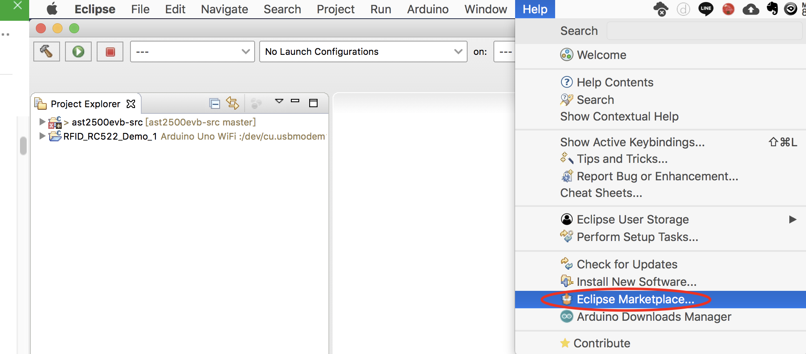
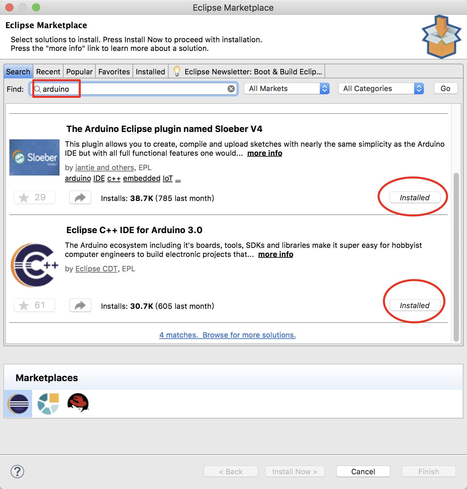
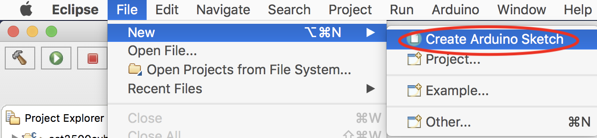
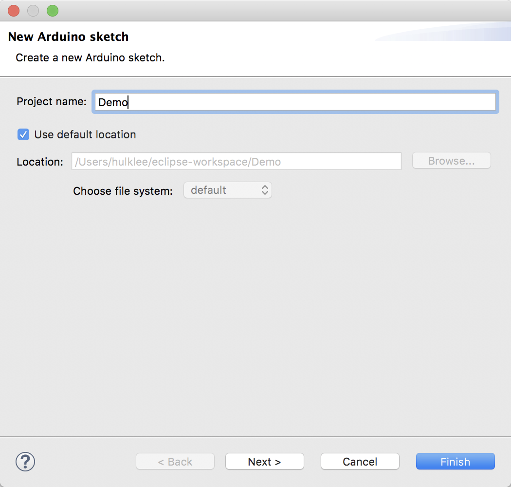
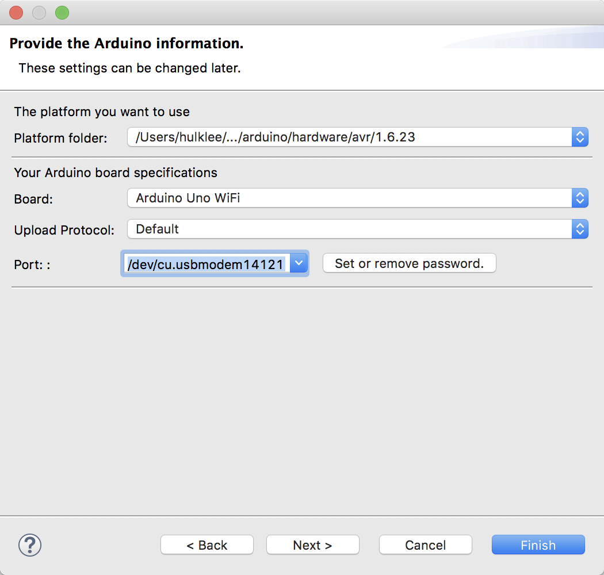
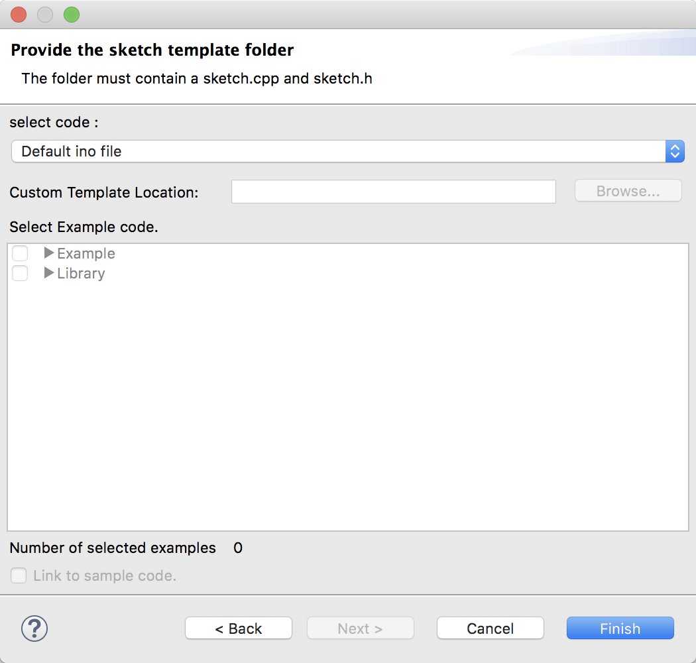
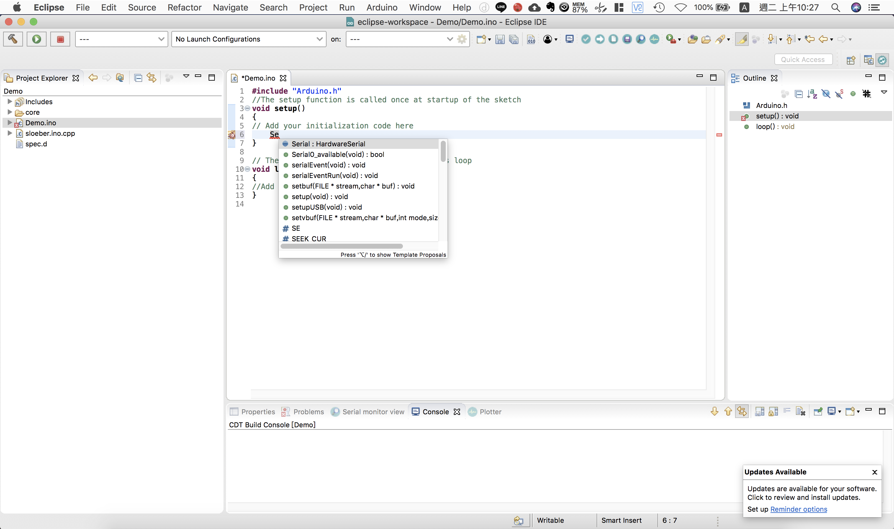
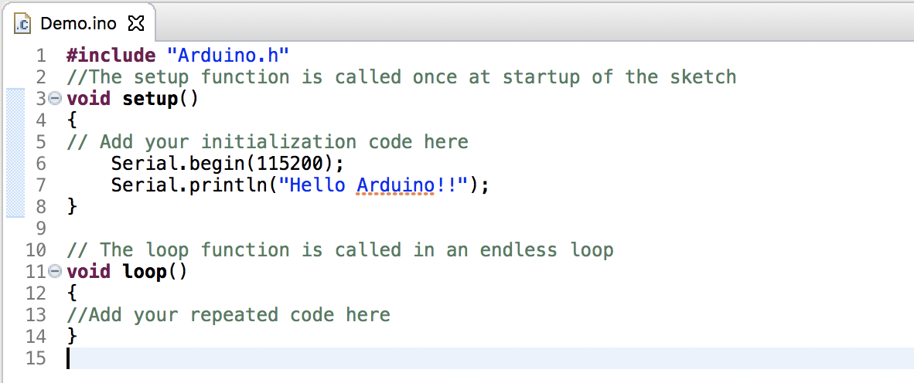
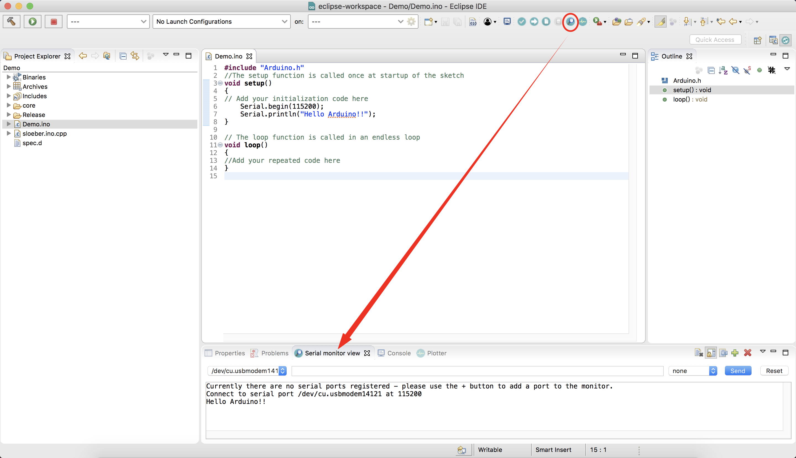

# 前言

使用官方提供的IDE有一個缺點，就是沒有程式碼自動補齊的功能，變成每一行程式碼每一個字都要一個一個手動去key in。我個人是比較喜好開源的IDE，像是Eclipse等。

Eclipse可以透過Plugin的方式來開發Arduino

底下就是說明如何去安裝這個Plugin

# 安裝

安裝Arduino Plugin的方式可以透過Eclipse Marketplace來安裝

在Find中輸入關鍵字**arduino**
這裡要安裝兩個plugin，**The Arduino Eclipse plugin named Sloeber V4**和**Eclipse C++ IDE For Arduino 3.0**

安裝完後會自動重啟Eclipse，此時就可以開啟Arduino專案了

# 使用

開啟新專案

輸入Project Name後，按下Next

設定使用的Board和Port後按下next

這邊就用default的按下Finish完成

把Demo.ino檔案打開

先設定Uart，使用自動補齊的方式
輸入**Se**後，在mac上快捷鍵是**「option + \」**，會出現如下的小視窗，選擇Serial

# 編譯與上傳

透過上方工具列執行編譯並上傳的動作

顯示Uart Console

