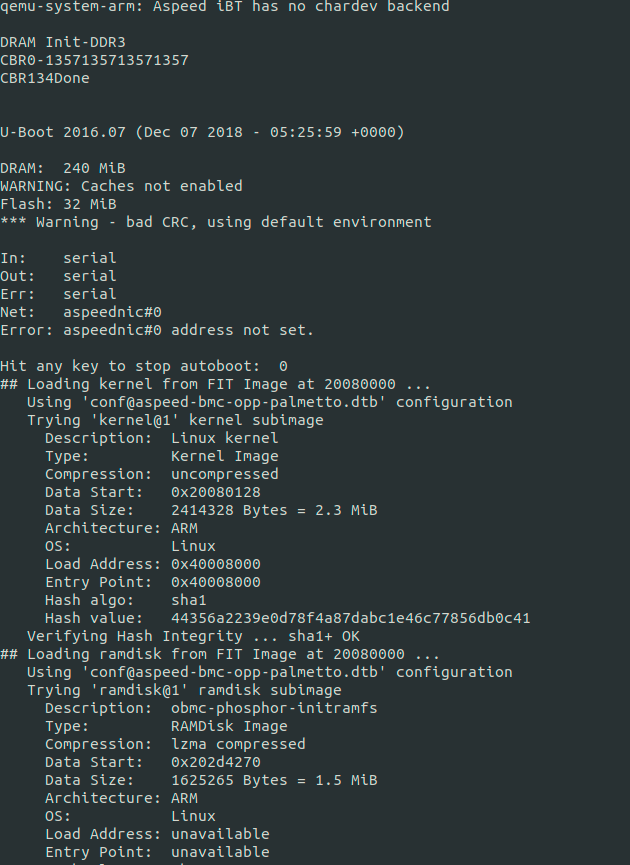
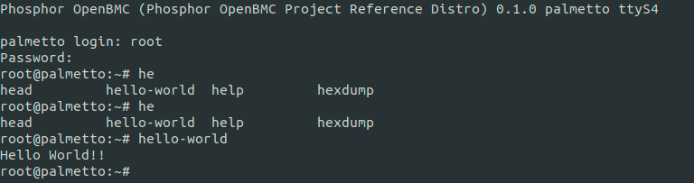

本文主要講述如何使用Yocto Recipes的方式並結合Makefile來結合OpenEmbedded編譯並放至image內

Yocto使用的是[OpenBMC](https://github.com/openbmc/openbmc)

# 下載Yocto

首先下載OpenBMC

```
$ git clone https://github.com/openbmc/openbmc.git
$ cd openbmc
$ TEMPLATECONF=meta-ibm/meta-palmetto/conf . openbmc-env
```

開始建立hello-world bb file以及相關原始檔

```
$ cd ../meta-phosphor
$ mkdir -p recipes-demo/myDemo/hello-world
$ cd recipes-demo/myDemo
$ touch hello-world.bb
$ cd hello-world
$ touch main.c Makefile
```

在recipes-demo目錄下，結構分佈如下

```
openbmc/meta-phosphor/recipes-demo$ tree
.
`-- myDemo
    |-- hello-world
    |   |-- Makefile
    |   `-- main.c
    `-- hello-world.bb

2 directories, 3 files
```


# 製作hello-world

編輯main.c

```main
#include <stdio.h>

void main()
{
    printf("Hello World!!\n");
}
```

編譯Makefile

```

obj = main.o
target = hello-world

all: $(obj)
	${CC} $(obj) -o $(target)

%.o:%.c
	${CC} -c $^ -o $@

.PHONY: clean
clean:
	rm -rf $(obj) $(target)
```

編譯hello-world.bb

```
SUMMARY = "Hello World Demo"
SECTION = "apps"
LICENSE = "CLOSED"

APP_NAME = "hello-world"
localdir = "/usr/local"
bindir = "${localdir}/bin"

TARGET_CC_ARCH += "${LDFLAGS}"

SRC_URI = "file://main.c \
           file://Makefile \
	   "

S = "${WORKDIR}"

do_compile() {
    make -f Makefile
        
}

do_install () {
    install -m 0755 -d ${D}${localdir}
    install -m 0755 -d ${D}${bindir}
    cd ${S}
    install -m 0755 ${APP_NAME} ${D}${bindir}
}

FILES_${PN}-dev = ""
FILES_${PN} = "${bindir}/*"
```

回到Yocto build目錄下，執行編譯hello-world

```
$ bitbake hello-world

openbmc/build$ bitbake hello-world
WARNING: Host distribution "ubuntu-18.04" has not been validated with this version of the build system; you may possibly experience unexpected failures. It is recommended that you use a tested distribution.
Loading cache: 100% |########################################################################################################################################################################| Time: 0:00:00
Loaded 3214 entries from dependency cache.
Parsing recipes: 100% |######################################################################################################################################################################| Time: 0:00:01
Parsing of 2276 .bb files complete (2274 cached, 2 parsed). 3215 targets, 338 skipped, 0 masked, 0 errors.
NOTE: Resolving any missing task queue dependencies

Build Configuration:
BB_VERSION           = "1.38.0"
BUILD_SYS            = "x86_64-linux"
NATIVELSBSTRING      = "ubuntu-18.04"
TARGET_SYS           = "arm-openbmc-linux-gnueabi"
MACHINE              = "palmetto"
DISTRO               = "openbmc-phosphor"
DISTRO_VERSION       = "0.1.0"
TUNE_FEATURES        = "arm armv5 thumb dsp"
TARGET_FPU           = "soft"
meta                 
meta-oe              
meta-networking      
meta-perl            
meta-python          
meta-webserver       
meta-phosphor        
meta-aspeed          
meta-openpower       
meta-ibm             
meta-palmetto        = "master:298c4328fd20fcd7645da1565c143b1b668ef541"

Initialising tasks: 100% |###################################################################################################################################################################| Time: 0:00:00
NOTE: Executing SetScene Tasks
NOTE: Executing RunQueue Tasks
NOTE: Tasks Summary: Attempted 446 tasks of which 437 didn't need to be rerun and all succeeded.

Summary: There was 1 WARNING message shown.

```

可以到hello-world的Workspace去檢查編譯檔和未來安裝到roots的目錄(位於/usr/local/bin)

```
openbmc/build/tmp/work/armv5e-openbmc-linux-gnueabi/hello-world/1.0-r0/image$ tree 
.
`-- usr
    `-- local
        `-- bin
            `-- hello-world

3 directories, 1 file
```


# 安裝到image

回到build目錄，編譯local.conf

```
$ vi conf/local.conf
```

增加此行

```
IMAGE_INSTALL_append = "hello-world"
```

執行完整編譯，需花費很長一段時間

```
$ bitbake obmc-phosphor-image
```


# 在QEMU上驗證

這邊有文件在描述如何安裝Qemu

https://github.com/openbmc/docs/blob/master/cheatsheet.md

照步驟安裝就好

到image目錄下，執行qemu

```
$ cd tmp/deploy/images/palmetto
$ qemu-system-arm -m 256 -M palmetto-bmc -nographic -drive file=flash-palmetto,format=raw,if=mtd -net nic -net user,hostfwd=:127.0.0.1:2222-:22,hostfwd=:127.0.0.1:2443-:443,hostname=qemu
```



帳號:root
密碼:0penBmc

驗證hello-world



離開qemu

先按[Ctrl +A],再按[x]