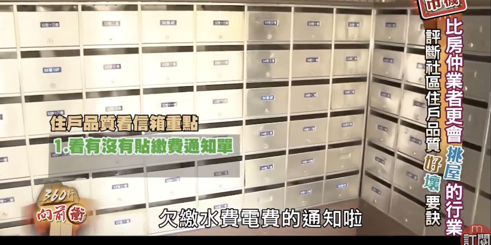
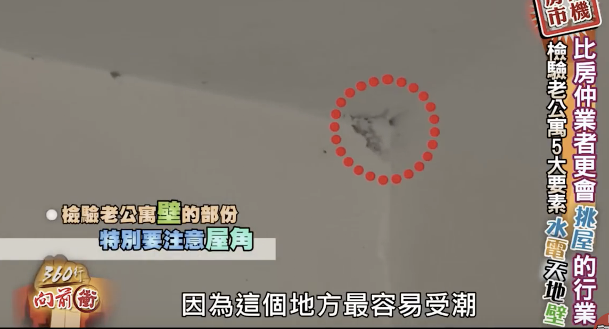

### 買屋挑屋兩大原則

1. 你要住多久？
2. 你要賣給誰？ 

### 評斷社區住戶品質好壞要訣

住戶品質看信箱重點

1. 看有沒有繳費通知單
2. 看有沒有空屋買賣

##### 看社區公佈欄重點

管委會有無在管理

1. 公布日期
2. 公布事項

##### 看房子內部特殊看法

1. 關掉總電源：觀察白天採光情形
2. 晚上，觀察外面的光源會不會影響到睡眠

### 老公寓都更是否的重點

1. 周遭是否一樣的舊公寓
2. 是否夾雜電梯大樓、透天厝

看老公寓的新門道

水、電、天、地、壁

##### 檢驗老公寓水的部分

1. 檢驗水龍頭出水情形
2. 同時檢驗排水情形
3. 打開所有水龍頭看水壓

##### 檢驗老公寓店的部分

如果有改過電路，不會保有舊電表。

##### 檢查老公寓天的部分

如果出現比較新的天花板，可能有壁癌的危機

##### 檢驗老公寓地的部分

看磁磚來分辨地板問題

##### 檢驗老公寓壁的部分

特別注意屋角

冷氣機的插座附近因為有線路空間水氣，這邊特別容易受潮而有壁癌。

##### 整修的預算要怎麼抓

大約一坪3萬元這樣抓

其他還有樑柱的問題

樑柱在中間的房子不要買

夫妻兩人收入3成去付房貸

| 條件項目 | A    | B    | C    | D    | E    |
| -------- | ---- | ---- | ---- | ---- | ---- |
| 交通環境 |      |      |      |      |      |
| 住戶品質 |      |      |      |      |      |
| 社區管理 |      |      |      |      |      |
| 採光通風 |      |      |      |      |      |
| 格局空間 |      |      |      |      |      |
| 公園休息 |      |      |      |      |      |

