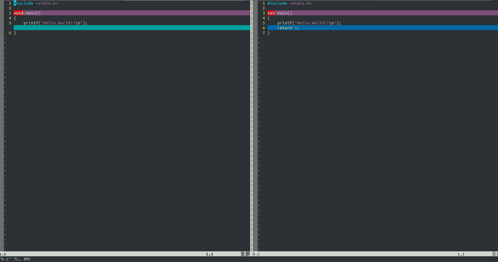

---

layout: post
title: "vimdiff的使用方法"
author:     Kevin Lee
tags: 		vimdiff Linux
subtitle:   
category:  project1
visualworkflow: true
---
在寫程式的過程當中，難免會有需要比較版本的需求，在Windows作業環境中已經有許多知名專門用來比較檔案差異的工具軟體，不過大多都是要錢。

而vimdiff是Linux終端機型的比較檔案的工具，不用錢！但使用前需要有一些學習曲線

使用方式

```
1. vimdiff [左檔案] [右檔案]
2. vimdiff 
```

底下是開啟後的範例




#### 差異點跳轉

]+c：下一個差異點

[+c：上一個差異點

#### 文件合併

d+p：當前差異點複製到另一個文件(diff put)

d+o:將另外一個文件的差異點複製到當前文件

u：撤銷修改

#### 更新比較

:diffupdate

#### 上下文展開與查看

z+a:折疊code

Z+o:展開摺疊的code

#### 使用上下視窗來比較

:diffsplit

#### 修改完後保存所有文件

:wqa